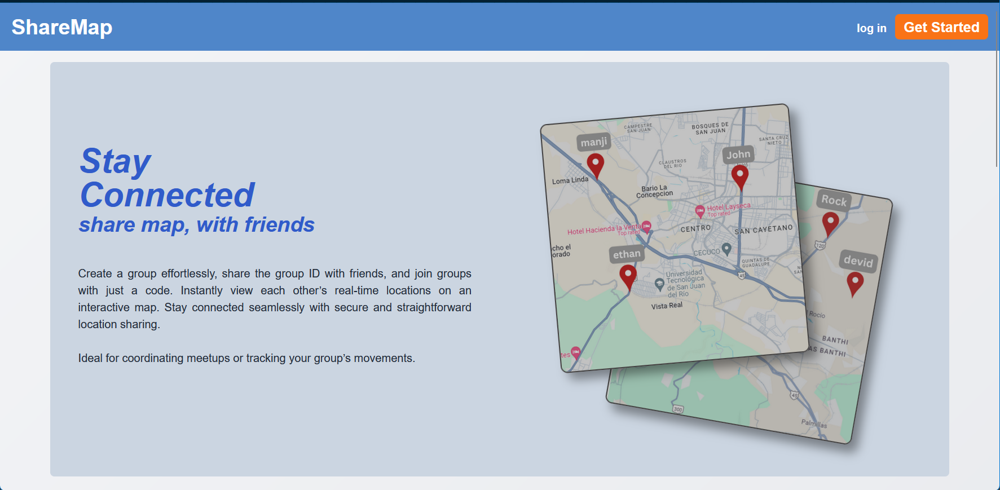
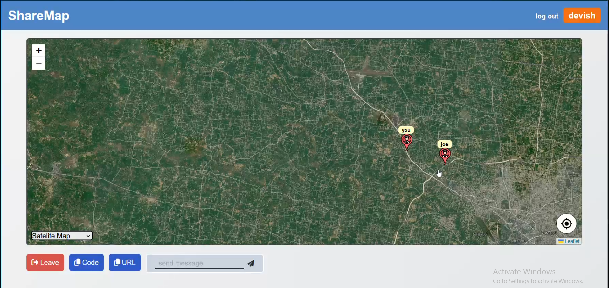

# **ShareMap** 🌍  
**Real-Time Group Location Sharing and Messaging Platform**

🚀 **Live Demo**: [ShareMap](https://sharemap.vercel.app)

## **📋 Project Overview**  
ShareMap is a full-stack web application designed to allow you and your friends to share real-time locations of all group members on a single interactive map. The project also features an in-app group messaging system, where any member can send messages that pop up at their location icon, making it incredibly useful during group travels, event coordination, or group activities.

[Watch the video](https://drive.google.com/file/d/1Sq7HaFR4Xq8I68gw_eKCIN12GQDDJkXn/view?usp=drive_link)

## **🛠️ Tech Stack**

### **Frontend**  
- **React**: Used for building the UI components and managing state.
- **Redux Toolkit**: State management to handle global app state.
- **React Router DOM**: For seamless navigation and routing.
- **Leaflet with MapTiler API**: For interactive map visualization.
- **Socket.io-Client**: For establishing real-time communication with the backend.

### **Backend**  
- **Node.js**: The core runtime environment for server-side logic.
- **Express**: Web framework for building the backend API.
- **MongoDB**: Database for storing user data, group information, and authentication details.
- **Socket.io**: Enables real-time bi-directional communication between server and clients.

### **Security and Encryption**  
- **crypto.js Library**: Used for encrypting data on the client-side before transmission and decrypting it on the receiving end, ensuring end-to-end encryption (E2EE).

### **Deployment**  
- **Frontend**: Deployed on Vercel for scalable and fast performance.
- **Backend**: Hosted on Render, providing seamless backend API connectivity.
- **MapTiler API**: Used for rendering the map and location services.
  

### **🔒 Data Privacy and Security**  
Your privacy is our priority! ShareMap only stores basic user data such as **username**, **name**, and **password**. It does **NOT** store any sensitive information like real-time locations or chat messages on the server. All data shared between clients is **end-to-end encrypted** using the `crypto.js` library, ensuring that your data remains confidential and secure. Messages and location data are encrypted on the client-side before being transmitted, and only authorized group members can decrypt it.

## **🎯 Key Features**  
- **Real-Time Location Sharing**: Track the live locations of group members with precise and up-to-date information using the MapTiler API.
- **Group-Based Messaging**: Send messages to group members, and watch them pop up dynamically at the sender’s location on the map, visible to everyone in the group.
- **Seamless Syncing**: Powered by Socket.io, the app provides real-time updates for both location and messaging, ensuring a smooth, live experience.
- **Interactive Maps and UI**: Switch between satellite view and OpenStreetMap layers, providing a flexible and engaging user experience.
- **Easy Group Joining**: Share a unique URL or group code to invite others. No complex setup—just send the link or code, and you’re connected.
- **Enhanced Security**: Each group is protected with a unique security key, ensuring that only authorized users can access and share data within the group.

## **🚀 Deployment**  
The project is deployed on **Vercel**. You can check out the live version at: [ShareMap](https://sharemap.vercel.app).

## **📧 Contact**  
Feel free to reach out for any suggestions or collaboration opportunities!

- **X**: [click!](https://x.com/shsa_X)
- **LinkedIn**: [click!](https://linkedin.com/in/shsax)
